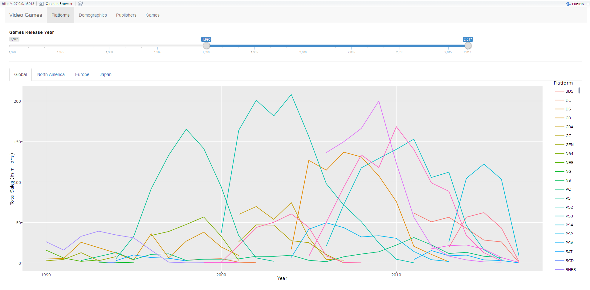
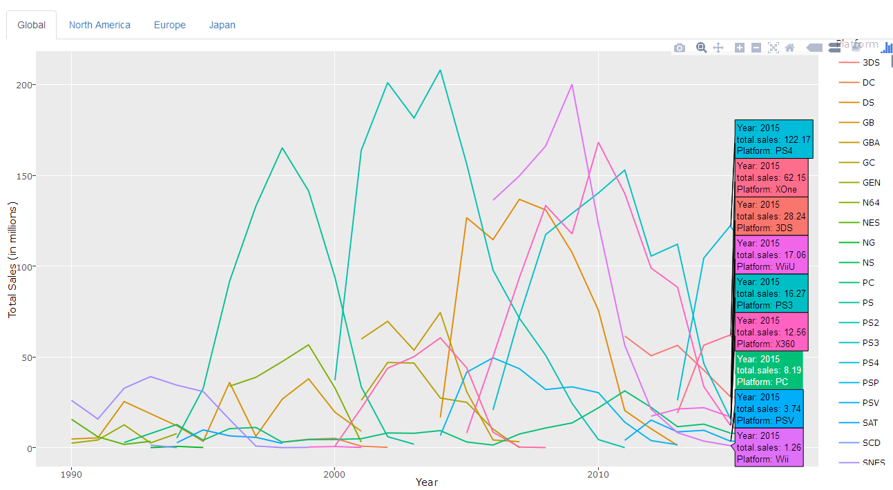
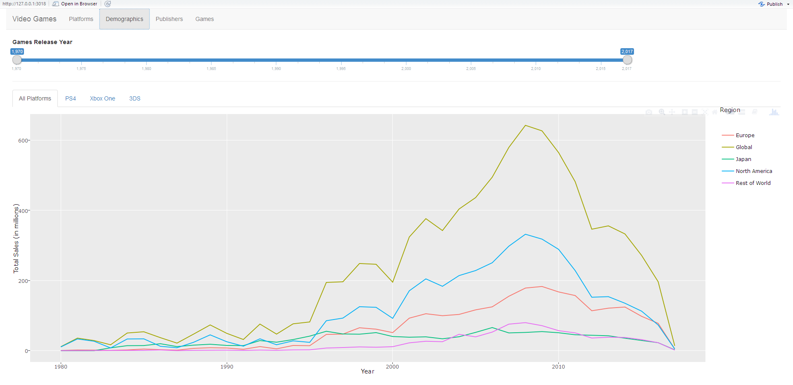
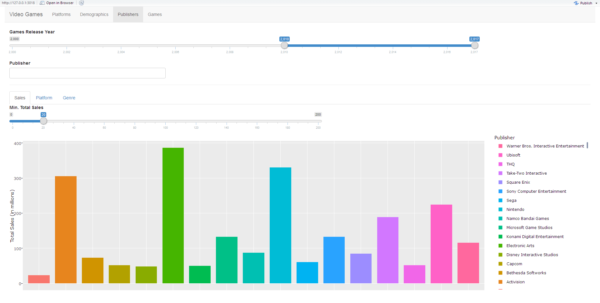
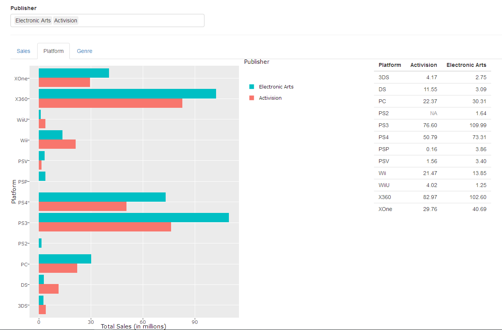
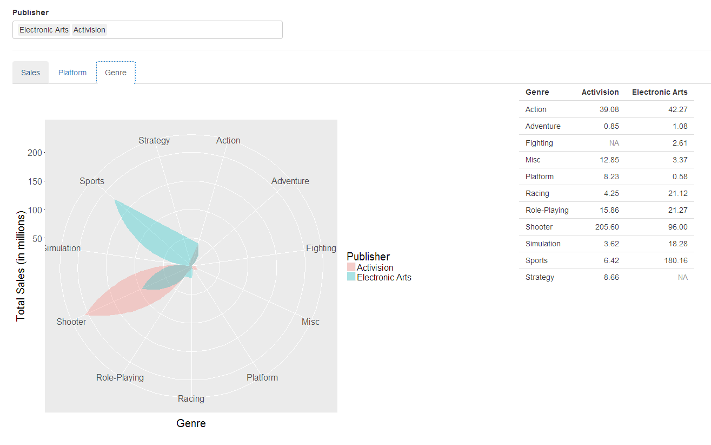
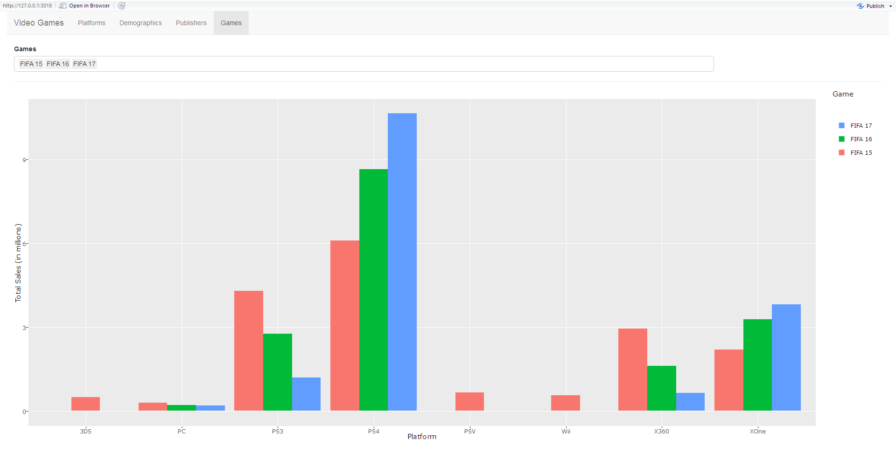

```{r setup, include=FALSE}
knitr::opts_chunk$set(echo = TRUE)
```

## Background
The video games refer to any electronic games that involve the interaction between human and a machine or we call console here. Up to date, we have more than 30 types of consoles or platforms being used. Some are phasing out while some are gaining momentum among video games players including teenagers and also adults. Apparently, I have not find a good site that shows an interactive graphics on the video games. I think this is a good time to incorporate skills that I learned from Stat 585x to make a shiny app that showcases analysis on video games.

## Data
The data is scrapped from the VGChartz website. Here is the [link](http://www.vgchartz.com). Here is an excerpt from their website describing VGChartz. "Founded in 2005 by Brett Walton, VGChartz (Video Game Charts) is a business intelligence and research firm and publisher of the VGChartz.com websites."[^1] VGChartz collects and estimates the data from games to consoles around the world. I will scrape the data from the website using `library(rvest)`. In Webscrapping section, I will briefly describe the data that will be use for the rest of this project.

[^1]: Quote from http://www.vgchartz.com/about.php


###WebScrapping
I scrapped top 10000 global games sales from VGChartz website. All sales are reported in millions and rounded to 2 decimal places. With that, it will be hard to see the difference for low revenue games sales as they are shown mostly close to zero. Below is the `R` code.
```{r scraping,message=F, warning=F}
library(rvest)
library(tidyverse)

url <- "http://www.vgchartz.com/gamedb/?name=&publisher=&platform=&genre=&minSales=0&results=10000"
html<- read_html(url)
#import and remove duplicated columns eg NA, EU, JPN, ..
rawdata_mat <- matrix(html %>% html_nodes("th , .chart td , .chart center") %>% html_text(),ncol=16,byrow = T)[,-c(8,10,12,14,16)]

data<-rawdata_mat[-c(1,nrow(rawdata_mat)),] #remove the last "Total" row

data_df<- data.frame(data)
colnames(data_df)<- rawdata_mat[1,] #Creating Header

#Update all columns types
data_df$Pos<-as.numeric(as.character(data_df$Pos))
data_df$Year<-as.numeric(as.character(data_df$Year))
data_df$`North America`<-as.numeric(as.character(data_df$`North America`))
data_df$Europe<-as.numeric(as.character(data_df$Europe))
data_df$Japan<-as.numeric(as.character(data_df$Japan))
data_df$`Rest of World`<-as.numeric(as.character(data_df$`Rest of World`))
data_df$Global<-as.numeric(as.character(data_df$Global))

head(data_df,5)
```

VGChartz collected all the sales of the video games around the globe through cross checking the video game's companies. inventory and sales. Above is the data table that will be used for the rest of this project. The data table consists of 

+ Pos refers to the ranking of the video games based on the overall sales, 
+ Game refers to the name of the video games,
+ Platform refers to the machine or consoles used to play the video games,
+ Year refers the year that the video games of the corresponding platform released,
+ Genre refers the genre the video games,
+ Publisher refers to the company that creates the video games,
+ North America Europe, Japan and Rest of World and Global refers to the sales for these specific regions.


##Introducing Shiny App
Here we will introduce the Shiny App which is an app that creates interaction between users and the outputs from `R`. This is the goal of this project where user with no web development skills will be able to execute and use the app to conduct analysis on video games. 

With the scrapped data, we can use `R` software along with `ggplot2` and `Plotly` packages to create different plots on `Shiny` app. In `Shiny` app, there are four tabs which can be breakdown into the following

1. Platforms
2. Demographics
3. Publishers
4. Games

Here is the screenshot of the app.



###Platforms
The screenshot above is for the Platforms page. The goal of this page is to display the trend of the sales based on the platforms over the years and also across the regions. There is a slider on top where user can cut and dice the duration of the video games release year. The graph below will react instantly based on the slider. The line graph is plotted under `Plotly` package. One of the features of `Plotly` is multiple labels as you hover the cursor. Below is the screenshot of the multiple labels. 



This is a great tool for analysis purpose. From the screenshot above, the platform PS4 has the highest sales where platform Wii has the lowest sales on the year 2015 overall. Not only that, the Platforms page also gives user to slice and dice across the region. The regions that are available on the page is Global, North America, Europe and Japan. We continue to massage the data and make statistical strong inference on the video game's sales using the region minitabs on the Platforms page.

###Demographics
This section we will look at the Demographics page. This page provides the user the access to look at the strength of demographics on video game's sales. Here is the screenshot of the Demographics page. 



We also picked three current popular platform of video games, PS4, Xbox One, and 3DS. Same as the Demographics page, there is slider for video games' release year. Underneath of it is the tabs for All Platforms and three platforms that we picked earlier. All the plot are plotted with `Plotly` as well. These tabs are helpful to learn the strength of these platforms in term of demographics.

From the screenshot, we can see that the sales of the video games across the globe reached peak on the year 2008 and then went down pretty quick. It slowed down on the year 2013 with a small bump and the trend kept the fashion going downward. This indicates that video games market is loosing the strength as entertainment tool among teenagers and adults.

###Publishers
A great art comes from a great artist. Same with video games, the publishers or the video games creators. This is the goal of this page. With what we observed in previous sections, it is crucial to look at the role and strength of publishers in video games sales. 

In this page, it carries more functionality than other pages. First, we are still interested with video games release year. We keep the slider on the same top panel. After that is the Pubisher box. This box only used for Platform tab and Genre tab which will be explained later. Next is the 3 minitabs, Sales, Platforms and Genre. In the Sales minitab, we have a slider that is for the bar chart below. This slider act as a filter by looking at the aggregate video games from the publishers that is greater than the value in this slider. This helps to filter out the small companies and focus on the big players in video games industry.

Here is the screenshot of Publishers page.



With the screenshot we can see the light green and the orange bars have significant high revenues on the video games which are Electronics Art and Activision. We would to look into these publishers. We use the platform box which the user can put in the publisher's names. We will use Electronics Art and Activision publishers as an example. We will look that the strength of platforms and genres of the video games that these publishers created.

Below is the screenshot of the minitab Platform.



In this minitab, there is a bar chart and a table with the numbers that were used to create the bar chart. 

Here is the screenshot of the minitab Genre. 



In this minitab, there is a radar chart along with the table of numbers that was used for radar chart.

From these plots, there are couple observations. It looks like the video games industry is more towards oligopoly where there are significant 3 large companies based on the first bar chart on this page. Now we compare two publishers side by side. From the bar chart in minitab Platform, both companies do not stick to one platform instead is driven by the popularity in the market. Electronic Arts has larger sales than Activision across all platforms except two platforms, Wii and WiiU. Looking the the genre, these two publishers are focusing on different genre. Activision games are toward shooter genre where Electronic Arts games are toward sports. This implies that there are different niche market among video games players.

###Games
This section we will look at the games of interest. Below is the screenshot of the Games page.



We used FIFA as the game of interest here. We used the same games but different release year, FIFA 15, FIFA 16, and FIFA 17. The last two numbers of the game refer to the year. Based on the plot above, we can see that as year goes, the video games players' interest on platform also shifts. For example, PS3 and X360 platforms are having downward trend as these are the old platforms compared with their upgraded version of platforms, PS4 and XOne. 

##Future Improvements
We have a couple of future improvements on this project. One is the data. The VGChartz website not only collect the data periodically but daily. We could scrap the data from their daily data and create a more detail visual graphics and analysis on the data. Not only looking the video games by sales, with daily data we can immediately capture the changes of the video games sales on platforms or genres week by week.

Second improvement that we can deploy here is to create a more accurate analysis. This is stemmed from the first improvement. On the daily data, the website numbers are not in million but down to dollar. This is extremely helpful for data analysis. We not only can look at the mature publishers but also beginners and intermediate publishers.


